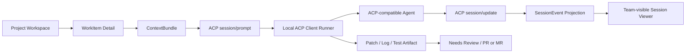
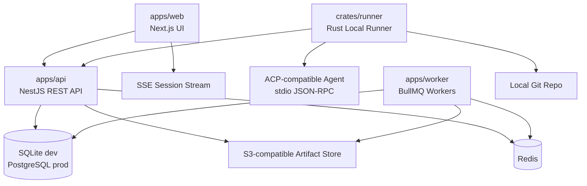

# TaskForge v0.1 技术设计文档

版本：v0.1  
状态：审查稿  
日期：2026-06-20  
关联文档：[v0.1_prd.md](./v0.1_prd.md)

## 1. 技术定位

TaskForge v0.1 是数据库驱动的工程任务执行控制面，不是新的 Coding Agent、云端沙箱平台或 Kubernetes Operator。产品概念的创新点在于把 WorkItem、ContextBundle、ACP AgentSession、SessionEvent 投影和 Artifact 串成团队可观察、可审计的执行闭环；底层实现必须优先复用成熟开源技术。

v0.1 的实现目标是稳定完成：



## 2. 技术原则

1. **成熟开源优先**：通用能力使用 SQLite、PostgreSQL、Redis、Next.js、NestJS、Prisma、BullMQ、Playwright、Zod、Tailwind、Radix 等成熟生态，不自行实现数据库、队列、鉴权框架、Web 框架、测试框架或 UI 基础组件。
2. **ACP 作为唯一 Agent 协议**：TaskForge 不自研 Client/Agent 或 Runner/Agent 通信协议。Agent 会话、权限请求、文件系统、终端和流式更新统一走 Agent Client Protocol v1；TaskForge 只做业务编排、ACP Client Host 和事件投影。
3. **必要时才自研**：只自研 TaskForge 独有的领域层、ContextBundle 编译、ACP prompt 映射、SessionEvent 投影、审计规则和产品 UI 组合。
4. **低风险技术准入**：通用库默认要求仓库未归档、近 12 个月活跃维护、许可证兼容、社区规模足够、生产案例可查。泛用库优先选择 5k+ stars；小众库只有在官方维护或领域必要时才可低于该门槛。
5. **数据库是事实来源**：本地开发使用 SQLite，正式部署使用 PostgreSQL。Redis、SSE、对象存储只做队列、传输和产物存储，不解释最终业务状态。
6. **Local Runner 边界不可破坏**：平台不得 clone 私有源码、运行测试或执行用户命令；所有代码读写和命令执行发生在用户本机 ACP Agent 中，由 Runner 作为 ACP Client Host 做传输和权限 relay。
7. **可替换架构**：GitHub/GitLab、ACP-compatible Agent、对象存储和认证提供方都通过接口隔离，避免早期选型锁死产品。

## 3. 推荐技术栈

### 3.1 总体选择

| 层 | 选择 | 用途 | 备注 |
| --- | --- | --- | --- |
| Monorepo | pnpm workspace + Cargo workspace | 管理 Web/API/Worker 与 Rust Runner | 前端后端 TypeScript；本地安装件使用 Rust 原生二进制 |
| Web | Next.js App Router + React | 项目空间、看板、Session Viewer | Next 仅做 Web/BFF 辅助，不承载核心业务状态 |
| UI | Tailwind CSS + shadcn/ui + Radix UI | 高密度控制台 UI、弹窗、表单、菜单 | 复用成熟组件，不自造基础控件 |
| API | NestJS | REST API、Runner 管理、权限、模块边界 | 模块化单体；仅 Provider SDK 成熟度需要时允许 sidecar |
| ORM | Prisma + SQLite dev + PostgreSQL prod | 数据模型、迁移、类型安全访问 | schema 受 SQLite/PostgreSQL 公共能力约束；迁移分 provider 管理 |
| Auth | Auth.js | GitHub/GitLab OAuth、Web 会话、Provider 接入 | v0.1 使用轻量方案；企业 SSO 后置 |
| Queue | BullMQ + Redis | 仓库同步、Finding 扫描、Context 编译、派发重试 | 队列不是事实来源，任务结果必须落库 |
| Repository Provider | 插件化 Provider Port + 成熟 SDK | GitHub/GitLab 仓库、Issue、PR/MR、Commit、CI 元数据 | SDK 成熟度优先于语言统一；必要时用 sidecar 微服务 |
| Local Runner | Rust + Tokio + clap + reqwest + serde | 本地 CLI/daemon、鉴权、心跳、传输、Artifact 上传 | 发布 macOS/Linux/Windows 单文件二进制，降低用户安装成本 |
| Realtime | SSE | UI 事件流 | Runner 与 Agent 使用 ACP stdio；UI 读平台事件投影 |
| Agent Protocol | ACP v1 + `agentclientprotocol/rust-sdk` | Local Runner 与 ACP-compatible Agent 交互 | 唯一 Agent 协议；禁止自研 Runner/Agent 协议 |
| Validation | Zod + serde | 平台业务 DTO、Runner DTO、ACP 映射边界、事件投影校验 | 不定义替代 ACP 的协议 schema |
| Artifact | S3-compatible storage + MinIO dev | Patch、日志、测试报告、Agent 总结 | 元数据在 SQLite/PostgreSQL |
| Test | Vitest、Supertest、Playwright、Testcontainers | 单元、API、端到端、集成测试 | SQLite 覆盖本地路径；PostgreSQL Testcontainers 覆盖生产约束 |
| Security | ACP permission gate + Gitleaks + deny path | 权限确认、Artifact 脱敏、敏感路径阻断 | 默认保守；宽松模式必须显式标记 |
| Logging | Pino + OpenTelemetry | 结构化日志、trace、metrics | Runner 和平台统一 traceId/sessionId |

### 3.2 选型快照

以下快照来自 2026-06-20 GitHub API，仅作为当前审查依据，后续实施前应重新刷新。

| 项目 | stars | 最近 push | License | 结论 |
| --- | ---: | --- | --- | --- |
| vercel/next.js | 140k+ | 2026-06-20 | MIT | 可用 |
| nestjs/nest | 75k+ | 2026-06-19 | MIT | 可用 |
| prisma/prisma | 46k+ | 2026-06-12 | Apache-2.0 | 可用 |
| nextauthjs/next-auth | 28k+ | 2026-06-12 | ISC | 可用 |
| taskforcesh/bullmq | 9k+ | 2026-06-20 | MIT | 可用 |
| microsoft/playwright | 91k+ | 2026-06-19 | Apache-2.0 | 可用 |
| colinhacks/zod | 43k+ | 2026-06-13 | MIT | 可用 |
| tailwindlabs/tailwindcss | 95k+ | 2026-06-19 | MIT | 可用 |
| radix-ui/primitives | 18k+ | 2026-06-16 | MIT | 可用 |
| gitleaks/gitleaks | 27k+ | 2026-06-13 | MIT | 可用 |
| octokit/octokit.js | 7.7k+ | 2026-06-18 | MIT | GitHub Provider 可用 |
| octokit/rest.js | 659 | 2026-06-20 | MIT | GitHub REST adapter 可用 |
| python-gitlab/python-gitlab | 2.4k+ | 2026-06-19 | LGPL-3.0 | GitLab Provider 候选，需许可证审查 |
| jdalrymple/gitbeaker | 1.7k+ | 2026-06-19 | 待核验 | GitLab TS 候选，需许可证审查 |
| gitlab-org/api/client-go | GitLab-hosted | 2026-06 活跃 | ECL-2.0 | GitLab Provider 候选，需许可证审查 |
| agentclientprotocol/agent-client-protocol | 3.4k+ | 2026-06-20 | Apache-2.0 | 采用为唯一 Agent 协议 |
| agentclientprotocol/rust-sdk | 160 | 2026-06-19 | Apache-2.0 | 官方领域 SDK，可用于 Runner |

ACP 和 Rust SDK stars 均低于通用库 5k+ 门槛，但它们是官方领域协议和官方 SDK，已有 Zed、JetBrains、Codex CLI adapter、Gemini CLI、Copilot public preview 等生态信号。结论是：v0.1 采用 ACP v1 作为唯一 Agent 通信协议；Local Runner 使用 Rust SDK 实现 ACP Client Host；非 ACP Agent 必须通过现有或单独封装的 ACP adapter 接入，TaskForge 核心不维护 direct CLI 私有协议。

## 4. 仓库结构

建议从单仓库开始，降低跨仓库协议漂移风险。

```text
apps/
  web/                 # Next.js UI
  api/                 # NestJS HTTP API + Runner 管理
  worker/              # BullMQ workers: sync, scan, context, dispatch
services/
  provider-gitlab/     # 可选 sidecar；仅当成熟 GitLab SDK 不在 TypeScript 时启用
crates/
  runner/              # Rust Local Runner CLI/daemon
  runner-core/         # ACP host、平台 client、spool、artifact、redaction
packages/
  contracts/           # OpenAPI DTO、业务 Zod schema；不定义 Agent 协议
  db/                  # Prisma schema, SQLite/PostgreSQL migrations, seed, SQL helpers
  domain/              # 状态机、权限判断、领域服务纯函数
  repository-provider/ # Provider Port、DTO、capability、插件注册协议
  repository-github/   # GitHub Provider implementation based on Octokit
  ui/                  # 共享 UI primitives / design tokens
  config/              # eslint, tsconfig, prettier, env schema
docs/
  v0.1_prd.md
  v0.1_technical_design.md
```

依赖方向必须单向：`apps/*` 可以依赖 `packages/*`；`packages/repository-provider` 只定义抽象端口和 DTO，不依赖任何 GitHub/GitLab SDK；具体 provider 插件依赖成熟 SDK 并向核心暴露统一接口；`crates/runner` 只依赖平台 OpenAPI 契约生成的 Rust DTO、ACP Rust SDK 和本地系统库，不反向依赖 TypeScript 业务实现；`packages/domain` 不访问数据库；`packages/db` 不依赖 Web 或 Runner。

## 5. 逻辑架构



平台侧由 API、Worker、Web、数据库、Redis 和对象存储组成。本地开发数据库是 SQLite 文件，正式部署数据库是 PostgreSQL。Runner 侧是用户本机常驻进程，通过 HTTPS 拉取可执行 Session、上传事件投影和 Artifact，并以 ACP Client 身份通过 stdio 启动 ACP-compatible Agent。平台不主动连接用户电脑，也不直接接触本地源码。

## 6. 模块边界

### 6.1 Web

Web 负责产品界面，不直接写业务数据库。核心页面包括 Project Workspace、Board、WorkItem Detail、AgentSession Viewer、Settings。Next.js Server Component 用于首屏读取项目、看板和详情数据；需要浏览器状态的看板拖拽、事件过滤、日志滚动和 Session 流式更新使用 Client Component。

数据访问策略：

- 普通 CRUD 使用 REST API + TanStack Query。
- SessionEvent 实时展示使用 SSE：`GET /api/sessions/:id/events/stream?afterSeq=123`。
- 用户操作统一走 API，不在前端推导最终状态。

### 6.2 API

NestJS API 使用模块化单体：

| 模块 | 职责 |
| --- | --- |
| AuthModule | 登录、会话、OAuth token 管理 |
| ProjectModule | Project、成员、项目设置 |
| RepositoryModule | Provider registry、GitHub/GitLab 连接、同步状态 |
| WorkItemModule | Requirement、Finding、WorkItem、Board |
| ContextModule | ContextBundle 编译、版本、stale 标记 |
| SessionModule | AgentSession 生命周期、事件读取、状态转换 |
| ArtifactModule | Artifact 元数据、上传、下载、脱敏状态 |
| AuditModule | append-only AuditLog |
| RunnerModule | RunnerProfile、心跳、工作租约、事件和数据传输 |

API 输出 OpenAPI 文档，作为 Web 和 Runner SDK 的契约。控制器只做鉴权、输入校验和调用应用服务；业务状态转换必须集中在 domain service 中。

### 6.3 Worker

Worker 处理异步、可重试、不要求立即返回的工作：

- repository sync：读取 Issue、PR/MR、commit、CI 基础状态。
- finding scan：CI 配置问题、文档漂移、测试缺口。
- context compile：生成 ContextBundle 版本和 token 估算。
- session dispatch：把 ContextBundle 和 Prompt 模板渲染成 ACP `session/prompt` 数据，等待 Runner 拉取。
- artifact postprocess：脱敏、摘要、索引、过期清理。

BullMQ job payload 只保存业务 ID 和轻量参数，不保存大对象或源码片段。Worker 每次执行必须从数据库重新读取事实状态。

### 6.4 Local Runner

Runner 是 Rust 实现的本地 CLI/daemon。它通过 GitHub Releases、Homebrew tap、Windows installer 或 `cargo install` 分发，目标是让普通用户安装一个原生二进制即可使用。它是薄传输层，不是 Agent adapter 框架，也不实现 Agent 私有协议。Runner 只负责四类事情：

1. 与平台鉴权、注册和刷新 token。
2. 向平台发送 heartbeat、状态和本地能力摘要。
3. 在平台和本地 ACP Agent 之间传输事件、权限请求和执行状态。
4. 传输 ContextBundle、Prompt 数据、日志、patch、测试报告和 Artifact。

调用用户本地 Agent 必须使用 ACP。Claude Code、Codex、Gemini 或其他本地 Agent 要么原生支持 ACP，要么通过现成 ACP adapter/wrapper 暴露 ACP；TaskForge 不直接解析这些 CLI 的私有 stdout/stderr，也不维护 `codex-cli-direct`、`claude-code-direct` 这类调用路径。

命令形态：

```text
taskforge login
taskforge register
taskforge bind-repo
taskforge start
taskforge status
taskforge doctor
taskforge logout
```

Runner 内部模块：

| 模块 | 职责 |
| --- | --- |
| CLI | `clap` 命令、配置路径、doctor 输出 |
| AuthClient | `reqwest` + `rustls` 登录、token 存储、刷新 |
| HeartbeatClient | heartbeat、版本、平台租约续期 |
| ControlApiClient | HTTPS 拉取待执行 Session、上传执行结果 |
| LocalBindingStore | 本地路径和仓库 remote 绑定；不上传源码 |
| AcpClientHost | 基于 `agent-client-protocol` 与 `agent-client-protocol-tokio` 启动或连接本地 ACP Agent |
| AcpPermissionRelay | 转发 `session/request_permission`、fs、terminal 请求并记录结果 |
| EventRelay | 把 ACP `session/update` 投影为平台 SessionEvent |
| DataRelay | 下载 Prompt/Context，上传 patch、日志、测试报告和 Artifact |
| LocalSpool | 网络中断时写入本地 NDJSON spool，恢复后补传 |
| Redactor | 上传前 secret masking、deny path 和 Gitleaks 扫描 |

Runner 不拥有 WorkItem 最终状态，不编排任务，不推导业务状态，不直接调用非 ACP Agent。它只把 ACP 事件和本地数据可靠传回平台。

### 6.5 ACP 调用模型

Agent Client Protocol（ACP）是 TaskForge 调用用户本地 Agent 的唯一协议。ACP 标准化的是 Client/Editor 与 Coding Agent 之间的 JSON-RPC 2.0 通信，包含 `initialize`、`authenticate`、`session/new`、`session/load`、`session/prompt`、`session/update`、`session/cancel`、权限请求、文件系统和终端相关能力。Runner 在这里扮演 ACP Client Host，并优先复用官方 Rust SDK，而不是手写 JSON-RPC lifecycle。

TaskForge 不设计自己的 Agent 协议：

- 平台到 Runner 的 HTTPS API 只是控制面和数据传输 API，不表达 Agent 行为语义。
- Agent 会话生命周期以 ACP session 为准，TaskForge 只保存 `agent_sessions.acp_session_id`、协议版本、Agent 信息和状态投影。
- `SessionEvent` 是 ACP `session/update`、permission、tool call、terminal 和文件变化的审计投影，不是替代 ACP 的协议。
- `RunnerProfile`、`AuditLog`、`Artifact` 是产品治理对象，不参与 Agent 协议设计。

ACP 运行路径：

1. 平台根据 WorkItem 和 ContextBundle 渲染 Prompt 数据。
2. Runner 通过 HTTPS 拉取待执行 Session 和 Prompt 数据。
3. Runner 使用 `agent-client-protocol-tokio` stdio transport 启动或连接本地 ACP Agent，执行 `initialize` 和必要的 `authenticate`。
4. Runner 使用 Rust SDK session builder 调用 `session/new` 或 `session/load`。
5. Runner 通过 `session/prompt` 发送平台渲染好的任务内容。
6. Agent 通过 `session/update` 流式返回消息、计划、工具调用和状态。
7. Agent 如需本地文件或终端能力，必须通过 ACP client methods 请求，由 Runner relay 并记录。
8. 用户或平台取消时，Runner 发送 `session/cancel`。

ACP 映射关系：

| TaskForge 数据 | ACP 使用方式 |
| --- | --- |
| WorkItem、ContextBundle、acceptanceCriteria | `session/prompt` content |
| mode、priority、workItemId、projectId | ACP `_meta.taskforge` |
| 用户停止 Session | `session/cancel` |
| Agent 进度、消息、计划、工具调用 | `session/update` |
| 权限确认 | `session/request_permission` |
| 文件读取/写入 | ACP `fs/read_text_file`、`fs/write_text_file` |
| 命令执行 | ACP terminal methods |
| Artifact 元数据 | 平台上传 API；与 ACP session 关联 |

安全边界仍然必须存在，但它是 ACP Client Host 的权限控制，不是自有 Agent 协议。即使 ACP Agent 请求 `fs/read_text_file`、`fs/write_text_file` 或 terminal capability，Runner 也必须根据本地绑定、平台策略和用户确认决定允许或拒绝，并把结果作为 ACP permission response 返回。

## 7. 核心数据模型

数据库是事实来源。本地开发使用 SQLite，正式部署使用 PostgreSQL。Prisma schema 管理大部分模型；PostgreSQL 是生产语义基准，SQLite 是开发便利路径，不作为并发、锁和性能判断依据。

### 7.1 ORM 兼容策略

Prisma 支持 SQLite 和 PostgreSQL，但 Prisma Migrate 生成的 SQL 与 datasource provider 绑定，不能把同一套 migration SQL 同时用于两个数据库。因此 v0.1 使用同一套领域模型约束、两套 provider schema 和两套 migrations：

```text
packages/db/prisma/
  sqlite/schema.prisma
  sqlite/migrations/
  postgres/schema.prisma
  postgres/migrations/
```

兼容规则：

- 生产 schema 以 PostgreSQL 为准；SQLite schema 只能做开发等价映射。
- 应用代码只通过 Prisma Client 和 domain service 访问数据库，不在业务层分叉 provider。
- 字段类型使用 SQLite/PostgreSQL 公共能力：`String`、`Int`、`Boolean`、`DateTime`、`Json`、relation、unique index。
- `Json` 字段只保存 opaque metadata；不要在通用业务逻辑里依赖 PostgreSQL JSONB path query、GIN index 或 SQLite JSON 函数。
- 避免 PostgreSQL-only Prisma native types、数组列、复杂 partial index、database trigger 作为通用逻辑前提。
- 状态枚举优先在 domain/Zod 层校验；如使用 Prisma enum，必须在两套 migrations 中显式验证生成 SQL。
- Provider-specific raw SQL 只能放在 `packages/db/sql/postgres/` 或 `packages/db/sql/sqlite/`，调用点必须有清晰分支和测试。
- CI 必须同时运行 `prisma validate`、client generation、SQLite smoke test 和 PostgreSQL Testcontainers 集成测试，防止 schema 漂移。

| 表 | 关键字段 | 说明 |
| --- | --- | --- |
| projects | id, name, description, created_by | 项目空间 |
| repositories | id, project_id, provider, url, default_branch, external_id, sync_status | GitHub/GitLab 仓库 |
| requirements | id, project_id, title, status, priority, source | 需求清单 |
| findings | id, project_id, repository_id, type, severity, evidence_json, status | 扫描问题 |
| work_items | id, project_id, type, status, priority, assignee_id, active_session_id | 看板核心对象 |
| context_bundles | id, work_item_id, version, source_refs_json, summary, token_estimate, stale_at | 执行上下文 |
| runner_profiles | id, owner_id, project_id, name, status, capabilities_json, last_heartbeat_at | 本地 Runner 注册信息 |
| repository_bindings | id, runner_id, repository_id, local_path_hash, remote_url_hash, status | 不保存本地源码 |
| agent_sessions | id, work_item_id, runner_id, context_bundle_id, acp_session_id, acp_agent_info_json, acp_protocol_version, mode, status, started_at, completed_at | 单次 ACP 执行尝试 |
| session_events | id, session_id, seq, type, payload_json, raw_acp_json, created_at | ACP-derived append-only 事件投影 |
| artifacts | id, session_id, type, storage_url, sha256, size_bytes, redaction_status | 执行产物 |
| prompt_versions | id, mode, version, template, checksum | Prompt 模板版本 |
| audit_logs | id, actor_id, action, target_type, target_id, payload_json, created_at | append-only 审计 |
| outbox_events | id, type, payload_json, status, retry_count, available_at | 事务后派发 |

必须建立的约束：

- `session_events(session_id, seq)` 唯一。
- `work_items.active_session_id` 同一时间最多指向一个非终态 Session。
- `session_events`、`audit_logs` 默认只允许 insert，不允许业务代码 update/delete；PostgreSQL 可用 trigger 强化，SQLite 本地开发以应用层 guard 和测试覆盖为主。
- Artifact 只保存元数据和 storage URL，不保存完整源码快照。

## 8. 启动 Session 的事务

用户点击 Start 后，API 必须在一个数据库事务中完成：

1. 校验用户有权启动该 WorkItem。
2. 锁定 WorkItem。PostgreSQL 使用 `SELECT ... FOR UPDATE`；SQLite 本地开发使用事务和唯一约束模拟，不作为生产并发语义依据。
3. 校验 WorkItem 没有 Running/Dispatching/Queued active session。
4. 创建或选择最新 ContextBundle；必要时标记 stale 并创建新版本。
5. 创建 AgentSession，状态为 `Created` 或 `Context Compiling`。
6. 写入 `session.created` 和 `context.compiled` 初始事件。
7. 更新 WorkItem：`status = In Progress`，`active_session_id = session.id`。
8. 写入 outbox event：`prepare_acp_prompt_turn`.
9. 写入 AuditLog：`session.start_requested`。

事务提交后，Dispatcher Worker 读取 outbox，把 ContextBundle、Prompt 模板和 WorkItem 元数据渲染为 ACP `session/prompt` 数据，并标记为等待 Runner claim。Runner 通过平台控制面 API 拉取该数据，再用 ACP 调用本地 Agent。派发失败必须写入 `runner.rejected` 或 `session.failed` 事件，不能静默丢弃。

## 9. 平台与 Runner 控制面

平台与 Runner 之间只需要控制面和数据传输 API，不再定义 Agent 协议。Agent 调用语义全部属于 ACP。

### 9.1 鉴权与心跳

Runner 通过 HTTPS 调用平台 API：

```json
{
  "runnerId": "runner_123",
  "version": "0.1.0",
  "acpClientVersion": "0.1.0",
  "acpAgents": [
    {
      "name": "claude-code",
      "launchCommand": "claude",
      "supportsAcp": true
    }
  ],
  "bindings": [{"repositoryId": "repo_123", "status": "bound"}],
  "status": "idle"
}
```

核心端点：

```text
POST /api/runner/register
POST /api/runner/heartbeat
POST /api/runner/sessions/claim
POST /api/runner/sessions/:id/events
POST /api/runner/sessions/:id/artifacts
POST /api/runner/sessions/:id/complete
```

### 9.2 Session Claim

Runner claim 到的不是自有 Agent 协议，而是可转发给 ACP Agent 的数据包和上传目标：

```json
{
  "sessionId": "ses_123",
  "workItemId": "wi_123",
  "projectId": "proj_123",
  "repositoryId": "repo_123",
  "localBindingRequired": true,
  "acp": {
    "protocolVersion": 1,
    "agentName": "claude-code",
    "cwdPolicy": "bound_repository",
    "sessionMode": "development",
    "prompt": {
      "content": "Fix ACP event relay dispatch gate...",
      "_meta": {
        "taskforge": {
          "sessionId": "ses_123",
          "workItemId": "wi_123",
          "contextBundleId": "ctx_123"
        }
      }
    }
  },
  "uploads": {
    "artifactBaseUrl": "https://taskforge.example.com/api/runner/sessions/ses_123/artifacts"
  }
}
```

Runner 收到后只做本地绑定校验和传输，不重新解释 WorkItem。它按 ACP 生命周期调用本地 Agent：`initialize`、必要的 `authenticate`、`session/new` 或 `session/load`、`session/prompt`，并在取消时发送 `session/cancel`。

### 9.3 SessionEvent 投影

Runner 把 ACP `session/update`、permission、tool call、terminal 和文件变更投影为 SessionEvent。事件必须追加写入，带单调递增 `seq`：

```json
{
  "sessionId": "ses_123",
  "seq": 42,
  "type": "command.finished",
  "createdAt": "2026-06-20T10:00:00.000Z",
  "payload": {
    "commandId": "cmd_7",
    "exitCode": 0,
    "durationMs": 12834,
    "redactionApplied": false
  }
}
```

平台接收事件时必须校验：

- runner 是否拥有该 session。
- `seq` 是否连续或可重放处理。
- event type 是否在事件投影枚举中。
- payload 是否通过 Zod schema。
- payload 中不得包含 denied path 内容或未脱敏 secret。

## 10. 实时展示策略

Runner 回传事件后，API 写入数据库，再推送给订阅方。UI SSE 订阅按 `session_id` 和 `afterSeq` 增量读取：

```text
GET /api/sessions/:sessionId/events?afterSeq=120
GET /api/sessions/:sessionId/events/stream?afterSeq=120
```

SSE 断线重连时，Web 端用最后看到的 `seq` 补拉历史事件。这样即使 Redis pub/sub 或 SSE fanout 丢消息，数据库仍能恢复完整过程。

## 11. Repository Provider

v0.1 支持 GitHub 和 GitLab，但核心业务不能直接依赖任何具体平台 SDK。Repository Provider 必须插件化：核心只依赖 `RepositoryProvider` 抽象端口，插件负责把外部 API 映射为内部 Repository、Issue、Pull/Merge Request、Commit、CI Status 等 DTO。

抽象端口：

```ts
interface RepositoryProvider {
  provider: "github" | "gitlab" | string;
  capabilities(): ProviderCapabilities;
  validateConnection(authRef: AuthRef): Promise<ProviderIdentity>;
  listRepositories(cursor?: PageCursor): Promise<Page<RepositoryRef>>;
  getRepository(ref: RepositoryRef): Promise<RepositorySnapshot>;
  listIssues(ref: RepositoryRef, cursor?: PageCursor): Promise<Page<IssueRef>>;
  listPullRequests(ref: RepositoryRef, cursor?: PageCursor): Promise<Page<ChangeRequestRef>>;
  listCommits(ref: RepositoryRef, range: CommitRange): Promise<Page<CommitRef>>;
  listCiStatuses(ref: RepositoryRef, sha: string): Promise<CiStatus[]>;
}
```

实现规则：

- 业务模块只能调用 `RepositoryProvider` 端口，不能直接 import Octokit、python-gitlab、GitBeaker 或 GitLab Go SDK。
- Provider 插件必须声明 manifest：`providerId`、SDK 名称和版本、认证类型、分页能力、rate limit 策略、支持的 GitHub Enterprise/GitLab Self-Managed base URL。
- 优先复用成熟 SDK。不得因为语言统一而手写大面积 GitHub/GitLab REST API wrapper。
- 如果最成熟 SDK 不在 TypeScript，允许用 provider sidecar 微服务封装。核心通过 OpenAPI/gRPC 调用 sidecar，sidecar 内部复用成熟 SDK。
- Provider 输出 DTO 必须稳定，字段缺失时显式标记 `unsupported` 或 `unknown`，不能把平台差异泄漏到 WorkItem、Finding、ContextBundle。
- 所有 Provider 都必须实现契约测试：分页、认证失败、rate limit、404/权限不足、self-managed base URL、增量同步。

Provider 选型：

| Provider | 默认实现 | 成熟库策略 | 结论 |
| --- | --- | --- | --- |
| GitHub | in-process TypeScript plugin | `octokit/octokit.js` 或 `@octokit/rest`，支持 token、GitHub App、Enterprise baseUrl、分页 | P0 |
| GitLab | sidecar 或 in-process plugin | 优先评估 `python-gitlab`、GitLab `client-go`、`@gitbeaker/rest`；按维护活跃度、覆盖面、许可证决定 | P0，但必须先完成许可证审查 |

GitLab Provider 不强制 TypeScript。如果 `python-gitlab` 或 GitLab `client-go` 在覆盖面、分页、self-managed 支持和维护状态上明显优于 Node SDK，则使用 `services/provider-gitlab` sidecar。sidecar 的接口仍由 `RepositoryProvider` 契约定义，部署上可以和 API 同机运行，避免把语言选择暴露给业务层。

GitLab 官方文档列出的 REST API client 多数属于社区维护，并非全部官方支持。因此 GitLab Provider 选型必须同时通过三项门槛：许可证可接受、API 覆盖足够、契约测试通过。若没有合格 SDK，才允许用 GitLab OpenAPI/REST 生成或封装最小 client；该封装仍必须位于 Provider 插件或 sidecar 内，不能进入业务模块。

平台只读取元数据和上下文引用，不 clone 远程仓库，不运行 CI，不读取完整源码。

## 12. ContextBundle 编译

ContextBundle 编译是 TaskForge 的核心自研逻辑，但输入输出必须结构化。

输入来源：

- WorkItem 描述、验收标准、复现步骤、评论。
- Requirement、Finding 证据。
- 关联 Issue、PR/MR、commit、CI 状态。
- 历史 AgentSession 摘要。
- 用户补充的相关文件路径和验证命令。

输出内容：

- `summary`：任务摘要。
- `goal`：可执行目标。
- `acceptanceCriteria`：验收标准。
- `sourceRefs`：结构化来源引用。
- `relatedFiles`：路径和片段摘要，不上传完整仓库。
- `history`：历史 session 结论。
- `recommendedCommands`：验证命令。
- `promptInput`：注入 Prompt 模板的结构化输入。

ContextBundle 必须版本化。WorkItem 关键信息或仓库同步结果变化后，旧版本标记 stale，但历史 Session 仍引用当时版本。

## 13. Artifact 策略

Artifact 类型：

- `patch`：`git diff --binary` 或标准 patch。
- `command_log`：命令输出，必须脱敏。
- `test_report`：测试摘要和失败详情。
- `agent_summary`：Agent 最终总结。
- `pull_request` / `merge_request`：外部链接和 commit 信息。
- `error_report`：失败原因、ACP 启动错误、权限拒绝、环境信息。

上传前必须执行：

1. deny path 检查：`.env`、`secrets/**`、`.ssh/**`、私钥文件禁止上传。
2. secret masking：token、API key、private key、OAuth credential。
3. Gitleaks 扫描：对 patch 和日志做二次检测。
4. sha256 计算：用于完整性校验。

Artifact 二进制内容进入 S3-compatible storage；数据库仅保存 metadata、hash、size、storage URL 和 redaction status。

## 14. 安全模型

### 14.1 平台权限

v0.1 使用基础项目成员权限：

| 角色 | 权限 |
| --- | --- |
| Owner | 项目设置、成员、仓库、Runner 策略、删除项目 |
| Maintainer | 创建/编辑 WorkItem、启动/停止 Session、管理 Finding |
| Contributor | 查看项目、领取任务、启动自己的 Runner Session |
| Reviewer | 查看 Context、Session、Artifact，修改 Review 状态 |
| Viewer | 只读查看项目和 Session |

复杂企业 RBAC、SSO、SCIM 后置到 v0.4+。

### 14.2 Runner 本地权限

Runner 本地权限比平台权限更保守。平台授权用户启动 Session，不代表本地 ACP Agent 可以访问任意资源。Runner 作为 ACP Client Host，必须对 ACP 权限请求、文件请求和终端请求做 relay、记录和拒绝：

- 本地路径存在。
- Git remote 与平台 repository 匹配。
- 工作区清洁或符合允许策略。
- 本地 Agent 支持 ACP 或已经通过外部 ACP adapter 暴露 ACP。
- terminal 请求符合平台策略和本地确认。
- 目标路径不在 denylist 内。
- 高风险操作，如 push、创建 PR/MR、删除文件，需要本地确认。

### 14.3 Secret 和 token

外部访问 token 必须加密存储。v0.1 可以使用应用层 AES-GCM 加密，主密钥来自环境变量或部署平台 secret store。不得在日志、SessionEvent、Artifact 中输出明文 token。

## 15. 部署架构

v0.1 本地开发默认使用 SQLite 文件，避免开发者必须启动 PostgreSQL。Redis 和 MinIO 仍可通过 Docker Compose 启动：

```text
taskforge-web
taskforge-api
taskforge-worker
redis
minio
```

正式部署必须使用 PostgreSQL，并通过 `prisma migrate deploy` 执行 PostgreSQL migrations。生产环境可以部署到普通 VM、容器平台或 PaaS。允许使用 Kubernetes 部署这些服务，但 Kubernetes 只作为部署底座，不作为业务对象建模层；不得把 Project、WorkItem、RunnerProfile、AgentSession 等实现为 CRD。

## 16. 测试策略

| 层级 | 工具 | 必测内容 |
| --- | --- | --- |
| Unit | Vitest | 状态机、权限、ACP 映射、Context 编译纯函数 |
| API | Nest testing + Supertest | REST 鉴权、事务、错误码、OpenAPI 契约 |
| Integration | SQLite + Testcontainers | SQLite 本地 smoke、PostgreSQL 约束、Redis 队列、outbox 派发、Artifact metadata |
| Runner | cargo test + fixture repo | ACP stdio lifecycle、权限 relay、事件投影、spool、redaction |
| E2E | Playwright | Board → WorkItem → Start Session → Session Viewer |
| Security | Gitleaks + dependency audit | secret 泄露、依赖漏洞、artifact 脱敏 |

最低验收测试必须覆盖：

- 同一 WorkItem 不能并发启动两个 active session。
- 非 ACP 本地 Agent 不会被 Runner 直接调用。
- ACP permission denial 会被记录并回传平台。
- SessionEvent 按 seq 追加，断线后可从 afterSeq 恢复。
- Artifact 中 secret 被脱敏或拒绝上传。
- Session 完成后 WorkItem 正确进入 Needs Review 或 Blocked。

## 17. CI/CD

CI 使用 GitHub Actions 或 GitLab CI 均可，流程保持平台无关：

```text
pnpm install --frozen-lockfile
pnpm lint
pnpm typecheck
pnpm db:validate:sqlite
pnpm db:validate:postgres
pnpm db:test:sqlite
pnpm db:test:postgres
pnpm test
pnpm test:integration
pnpm test:e2e
cargo fmt --check
cargo clippy --workspace --all-targets -- -D warnings
cargo test --workspace
cargo build --release -p taskforge-runner
gitleaks detect
docker build
```

合并前必须通过 lint、typecheck、Prisma 双 provider 校验、unit test、核心集成测试、Rust fmt/clippy/test 和 secret scan。E2E 可以按 PR 标签或 nightly 运行，但 release 前必须通过。Runner release 使用 GitHub Actions 交叉构建 macOS、Linux、Windows 二进制，并生成 sha256 checksum。

## 18. 不采用或后置的方案

| 方案 | 结论 | 原因 |
| --- | --- | --- |
| 云端 Runner / 云端源码执行 | v0.1 不做 | 破坏安全和产品边界 |
| Kubernetes Operator / CRD 业务对象 | v0.1 不做 | PRD 明确数据库驱动业务控制面 |
| 自研 Agent 协议 | 不做 | ACP 是唯一 Agent 调用协议 |
| 业务代码直接调用 GitHub/GitLab REST | 不做 | 必须经过 RepositoryProvider 插件抽象 |
| 为统一 TypeScript 手写 GitLab SDK | 不做 | SDK 成熟度优先；必要时用 sidecar 复用成熟库 |
| 多 Agent 编排框架 | v0.1 不做 | 不做新 Agent；只接入 ACP-compatible Agent |
| Temporal / Kafka / NATS | 后置 | 成熟但当前过重，BullMQ + outbox 足够 |
| 全量源码索引 | 后置 | v0.1 只保存路径、摘要、必要片段 |
| 企业 SSO / 复杂 RBAC | 后置 | 先验证 Local Runner 闭环 |
| 自研 UI 组件库 | 不做 | 复用 Tailwind、Radix、shadcn/ui |
| 自研队列或 ORM | 不做 | 成熟开源已有足够能力 |

## 19. 实施里程碑

### M0：工程骨架

- pnpm workspace + Cargo workspace。
- Next.js Web、NestJS API、Worker 和 Rust Runner。
- SQLite dev database、Redis、MinIO docker compose。
- Prisma SQLite/PostgreSQL schema 初版和 provider-specific migrations。
- `crates/runner`、`crates/runner-core`、`packages/contracts`、`packages/repository-provider` 和业务 Zod schema。

### M1：项目和看板闭环

- Project、Repository、Requirement、Finding、WorkItem CRUD。
- Board 页面和 WorkItem Detail。
- RepositoryProvider 抽象端口和契约测试。
- GitHub Provider：Octokit adapter。
- GitLab Provider：成熟 SDK 选型、许可证审查、sidecar/in-process 决策。
- AuditLog 基础写入。

### M2：Runner 薄传输层

- Runner login/register/bind-repo/start/status/doctor。
- Rust Runner 基础 CLI、配置目录、token 存储。
- HTTPS heartbeat、能力摘要、repository binding。
- Session claim、事件上传、Artifact 上传。
- 基于官方 Rust SDK 的 ACP Client Host 初始化和本地 Agent 发现。

### M3：Session 执行闭环

- Start Session 事务。
- ContextBundle v0 编译。
- Dispatcher outbox 生成 ACP `session/prompt` 数据。
- ACP `initialize`、`session/new`、`session/prompt`、`session/update` 闭环。
- SessionEvent append-only 写入和 SSE Viewer。

### M4：Artifact 和安全

- Patch/log/test Artifact。
- ACP permission relay、deny path、Gitleaks redaction。
- Artifact 下载和审计。
- PR/MR 记录或手动创建入口。

### M5：验收和硬化

- 端到端验收场景。
- 集成测试和 Playwright E2E。
- 失败恢复、Runner offline/interrupted 处理。
- 文档、部署脚本、release checklist。

## 20. 审查问题

1. Rust Runner v0.1 是否只做 CLI/daemon，不做托盘应用？如果需要托盘和自动更新，再评估 Tauri，但不影响 Runner core。
2. UI 实时流是否采用 SSE 作为 v0.1 默认？Runner 控制面默认使用 HTTPS polling/claim，后续再评估长连接。
3. Repository Provider 是否接受 sidecar 作为正式插件形态？建议接受，用于复用非 TypeScript 成熟 SDK。
4. Auth.js 是否满足 v0.1 登录和 OAuth 需求，还是需要从第一版引入 Keycloak 等更重方案？
5. BullMQ + Redis 是否可以作为 v0.1 异步任务基础，还是希望先用 database-only outbox worker 减少部署依赖？
6. SQLite 本地开发是否接受“非生产并发语义”限制？生产级事务、锁和迁移验收以 PostgreSQL Testcontainers 为准。
7. GitLab Provider 优先选择哪条成熟库路线：`python-gitlab` sidecar、GitLab `client-go` sidecar，还是许可证确认后的 `@gitbeaker/rest` in-process adapter？

## 21. 参考来源

- Next.js docs: https://nextjs.org/docs
- NestJS docs: https://docs.nestjs.com/
- Prisma docs: https://www.prisma.io/docs
- Prisma supported databases: https://www.prisma.io/docs/orm/core-concepts/supported-databases
- Prisma Migrate limitations: https://www.prisma.io/docs/orm/prisma-migrate/understanding-prisma-migrate/limitations-and-known-issues
- Auth.js docs: https://authjs.dev/
- BullMQ docs: https://docs.bullmq.io/
- Playwright docs: https://playwright.dev/docs/intro
- PostgreSQL docs: https://www.postgresql.org/docs/current/
- SQLite docs: https://www.sqlite.org/docs.html
- GitHub REST API docs: https://docs.github.com/en/rest
- Octokit REST docs: https://github.com/octokit/rest.js
- GitLab REST API docs: https://docs.gitlab.com/api/rest/
- GitLab REST API third-party clients: https://docs.gitlab.com/api/rest/third_party_clients/
- GitLab client-go: https://gitlab.com/gitlab-org/api/client-go
- python-gitlab docs: https://python-gitlab.readthedocs.io/
- Agent Client Protocol overview: https://agentclientprotocol.com/protocol/v1/overview
- Agent Client Protocol architecture: https://agentclientprotocol.com/get-started/architecture
- Agent Client Protocol transports: https://agentclientprotocol.com/protocol/v1/transports
- Agent Client Protocol schema: https://agentclientprotocol.com/protocol/v1/schema
- Agent Client Protocol agents: https://agentclientprotocol.com/get-started/agents
- Agent Client Protocol repository: https://github.com/agentclientprotocol/agent-client-protocol
- ACP Rust SDK repository: https://github.com/agentclientprotocol/rust-sdk
- ACP Rust SDK docs.rs: https://docs.rs/agent-client-protocol
- GitHub repositories checked on 2026-06-20: Next.js, NestJS, Prisma, Auth.js, BullMQ, Playwright, Zod, Tailwind CSS, Radix UI, Gitleaks, Octokit, python-gitlab, GitBeaker, Agent Client Protocol, ACP Rust SDK.
